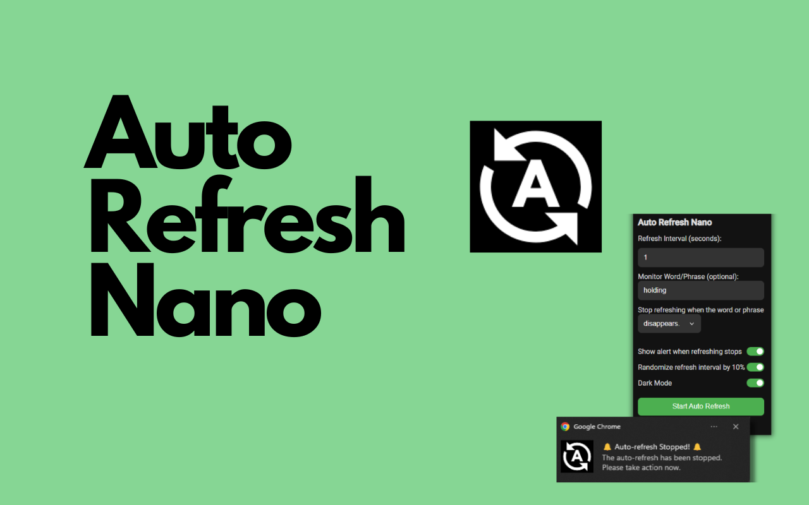

<h2>Monitor websites for changes in Chrome</h2>

Automatically refresh a webpage and stop refreshing when something changes.

## Features
- Automatically refresh a webpage at set intervals (e.g., every 30 seconds).
- Optionally stop the auto-refresh when a specific word or phrase appears or disappears from the tab.

## Versions
- 1.3 - You can now monitor for words that disappear from the tab on refresh! Fixed notification bugs, removed the sound file (it wasn't playing anyway because of browser security settings).
- 1.2 - Interval value now saved between sessions (you'll need to run at least one auto-refresh to save it). Added a 'randomness' toggle that randomises the refresh interval by up to 10%.
- 1.1 - Updated with alert, dark mode, background refresh
- 1.0 - Refresher release

## Installation Guide

Please note: this extension is now live on the Chrome web store, and can easily be installed at this link:

https://chromewebstore.google.com/detail/auto-refresh-extension/haiekoimldaeincnjchccogfbejgbmej

The below instructions are for if you want to install the files for testing or further development.

Follow these simple steps to install the extension from GitHub onto your Chrome browser.

### Step 1: Download the Extension Files
1. Click on the green "Code" button at the top of the GitHub repository page.
2. Choose the **Download ZIP** option to download the extension files to your computer.
3. Extract the downloaded ZIP file to a location on your computer (you will need this folder in the next steps).

### Step 2: Enable Developer Mode in Chrome
1. Open the **Chrome** browser on your computer.
2. In the address bar, type `chrome://extensions/` and press **Enter**.
3. At the top right, toggle the switch for **Developer mode** to turn it on. You should see additional options such as "Load unpacked" appear at the top.

### Step 3: Load the Extension
1. On the **Extensions** page (`chrome://extensions/`), click the **Load unpacked** button.
2. A file dialog will appear. Navigate to the folder where you extracted the extension files in Step 1, select the folder, and click **Select Folder** (on Windows) or **Open** (on macOS).
3. The extension will now be loaded into Chrome, and you should see the Auto Refresh extension icon appear in your browser toolbar.

### Step 4: Pin the Extension (Optional)
1. In the **Chrome toolbar**, click the puzzle piece icon (Extensions).
2. Find the **Auto Refresh** extension and click the pin icon next to it to keep it visible in your browser toolbar.

## How to Use the Extension

1. **Open the extension** by clicking on the Auto Refresh icon in your Chrome toolbar.
2. **Set the refresh interval**:
   - Enter the number of seconds for how often you want the page to automatically refresh.
3. **Optional: Set a stop word**:
   - Enter a word or phrase that, if found on the page, will automatically stop the refreshing. Leave this field blank if you don’t want the page to stop refreshing.
4. **Start the auto-refresh**:
   - Click the **Start Auto Refresh** button to begin refreshing the current webpage at the set interval.
5. **Stop the auto-refresh**:
   - To stop the auto-refresh manually, click the **Stop Auto Refresh** button.

### Example Use Case:
- Set a webpage to refresh every 10 seconds while waiting for a specific word (like "available" or "sold out") to appear. The extension will stop refreshing automatically when it finds that word.

## Troubleshooting

If the extension is not working as expected:
- Ensure that **Developer mode** is enabled in Chrome.
- Make sure you have selected the correct folder when loading the extension.
- Verify that you've entered a valid interval (at least 1 second).

